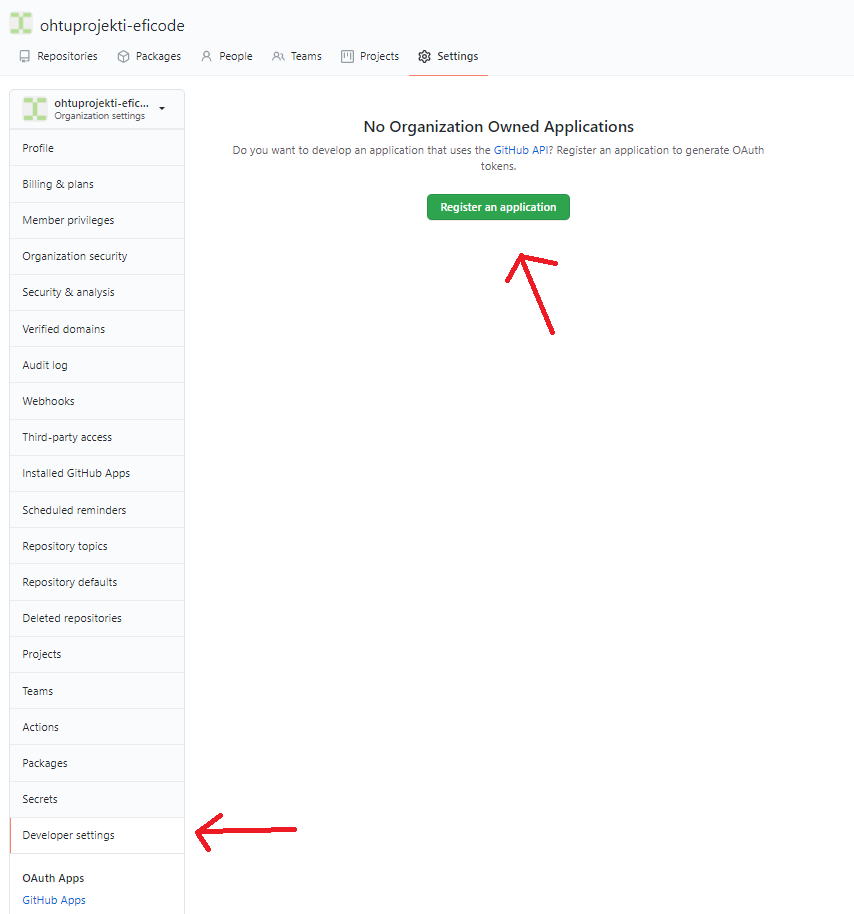
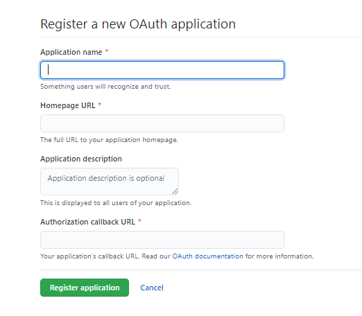
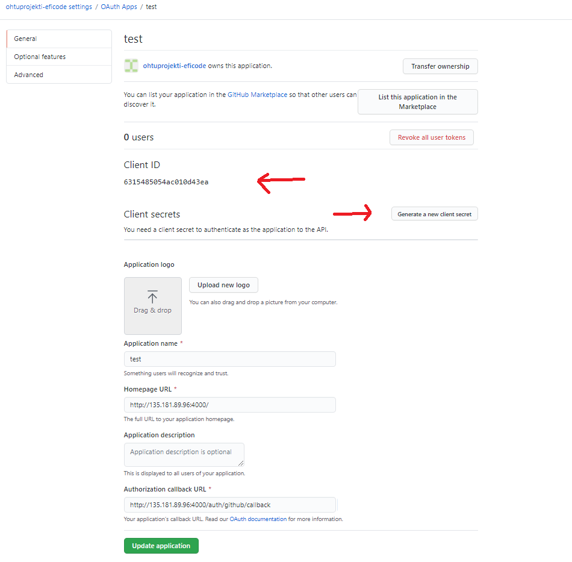
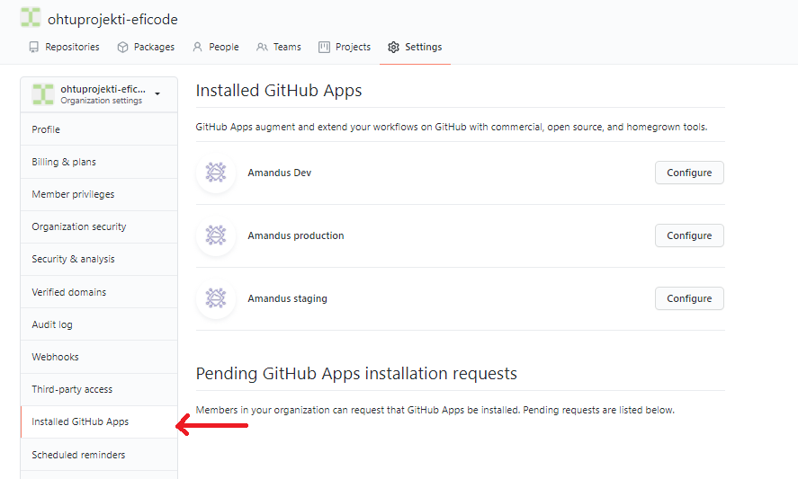

# General documentation

## Setting up a Github application

The application has a feature to fetch user details and an authorization token from Github. This requires settings up a Github application and configuring it correctly. The procedure is as follows:

1. Navigate to your personal or organization settings and find the `developer settings` to register a new application.

2. Fill in the details. The `callback url` is the most important part here and we set it to `http://135.181.89.96:4000/auth/github/callback` because our application is running at `http://135.181.89.96:4000/`

3. Once you create the application, you are redirected to the configuration page. Here you need to create a client secret and also copy your client id.

4. Now you're done. You can also access the settings after creation by navigating to `Installed Github apps`

5. The application has environment values `GH_CLIENT_ID`, `GH_CLIENT_SECRET` & `GH_CB_URL`. These are the client id, client secret and callback url from your newly created app. The [backend documentation](backend.md) has more information regarding the environment values required.

### Running the application locally for development

##### Without docker-compose

* Follow the instructions in [frontend documentation](frontend.md) and [backend documentation](backend.md) to start the services individually
* Remember to also setup a `postgresql` database and configure the backend's `DATABASE_URL` accordingly

##### With docker-compose

1. Setup the correct backend environment values as described in [backend documentation](backend.md)
2. Run `yarn` in both `/frontend` & `/backend` folders 
3. Run `sudo docker-compose build` 
4. Run `sudo docker-compose up`
    * Sometimes the backend fails to start during the first run due to `postgresql` not starting fully before migrations run. Restarting this a couple of times has always fixed the issue. 
5. The application should be viewable in `localhost:3000` and the graphlql playground at `localhost:3001`

### Running the application in production

The production version is ran with the `Dockerfile` found in the root of this repository. The easiest way to use it with our `docker-compose.server.yml`, also found in the root. The `docker-compose.server.yml` has placeholders for all the environment values required. It also has `docker/watchtower` configuration in place. This is not vital if you do not wish to use it for automatic updating of the image from `dockerhub`.

#### Fastest way to get the application running by pulling from dockerhub

1. Fill the environment values in `docker-compose.server.yml` as described in [backend documentation](backend.md)
3. Fill in the desired ports
3. Change the `image: ''` placeholder to `image: ohtuprojekti/wevc:application-production`. This pulls the production tag from [our dockerhub](https://hub.docker.com/repository/docker/ohtuprojekti/wevc). Github actions builds and pushes this image when the `master` branch is updated.
4. Run `sudo docker-compose up` to start the application to the port you configured
    * Sometimes the application fails to start during the first run due to `postgresql` not starting fully before migrations run. Restarting this a couple of times has always fixed the issue. 

#### Build the production version locally and run it

1. Fill the environment values in `docker-compose.server.yml` as described in [backend documentation](backend.md)
3. Fill in the desired ports
3. Change the `image: ''` to `build: .`
4. Run `sudo docker-compose build` to build the `Dockerfile`
5. Run `sudo docker-compose up` to start the application to the port you configured
    * Sometimes the application fails to start during the first run due to `postgresql` not starting fully before migrations run. Restarting this a couple of times has always fixed the issue. 
